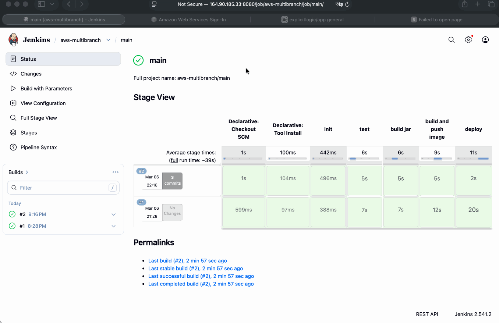

# Module 9 - AWS Services

This repository contains a demo project created as part of my **DevOps studies** in the **TechWorld with Nana – DevOps Bootcamp**.

https://www.techworld-with-nana.com/devops-bootcamp

***Demo Project:*** CD - Deploy Application from Jenkins Pipeline on EC2 Instance (automatically with docker-compose)
***Technologies used:*** AWS, Jenkins, Docker, Linux, Git, Java, Maven, Docker Hub

***Project Description:*** 

- Install Docker Compose on AWS EC2 Instance
- Create `docker-compose.yml` file that deploys our web application image
- Configure Jenkins pipeline to deploy newly built image using Docker Compose on EC2 server
- Improvement: Extract multiple Linux commands that are executed on remote server into a separate shell script and execute the script from Jenkinsfile

---

## Prerequisites

> **Complete the previous demo project first.**
> The EC2 instance must be launched with Docker installed.
> See [aws-module-9.1](https://github.com/explicit-logic/aws-module-9.1) for setup instructions.

> **Authenticate with Docker Hub before proceeding:**
> ```bash
> docker login
> ```

---

## Setup

### 1. Install Docker Compose on AWS EC2 Instance

> Reference: https://gist.github.com/npearce/6f3c7826c7499587f00957fee62f8ee9

**Download the binary:**
```sh
sudo curl -L https://github.com/docker/compose/releases/latest/download/docker-compose-$(uname -s)-$(uname -m) -o /usr/local/bin/docker-compose
```

**Fix permissions:**
```sh
sudo chmod +x /usr/local/bin/docker-compose
```

**Verify installation:**
```sh
docker-compose version
```

---

### 2. Create `docker-compose.yml`

See [./docker-compose.yaml](./docker-compose.yaml) for the configuration that deploys the web application image.

---

### 3. Configure Jenkins Multibranch Pipeline

> Groovy deploy function: `deployApp` in [app/script.groovy](./app/script.groovy)

#### Create the Pipeline Job

1. Go to **Dashboard** → **New Item**
2. Name it `aws-multibranch`, select **Multibranch Pipeline**, click **OK**

#### Branch Sources

Click **Add source** → **Git** and configure:

| Field | Value |
|---|---|
| Credentials | `github` |
| Repository HTTPS URL | `https://github.com/explicit-logic/aws-module-9.3` |

Click **Validate** to confirm access.

#### Behaviors

Click **Add** and include:
- `Discover branches`
- `Discover pull requests from origin`

#### Build Configuration

| Field | Value |
|---|---|
| Script Path | `Jenkinsfile` |

#### Scan Multibranch Pipeline Triggers

Click **Save** — Jenkins will scan the repository and automatically create jobs for each branch.

---

### 4. Create SSH Key Credentials for the EC2 Server

1. Navigate to the `aws-multibranch` pipeline → **Credentials** → **Add Credentials**

2. Fill in the following fields:

| Field | Value |
|---|---|
| Kind | `SSH Username with private key` |
| ID | `aws-ec2` |
| Username | `ec2-user` |
| Private Key | Paste the contents of your `.pem` file |

To copy the private key content:
```bash
cat ~/.ssh/app-key.pem
```

3. Run the pipeline job.


---

### 5. Improvement: Shell Script Extraction

Instead of embedding multiple remote commands inline in the Jenkinsfile, they are extracted into a dedicated shell script that gets copied and executed on the EC2 server.

> Groovy deploy function: `deployScript` in [app/script.groovy](./app/script.groovy)

Run the pipeline job to verify:


